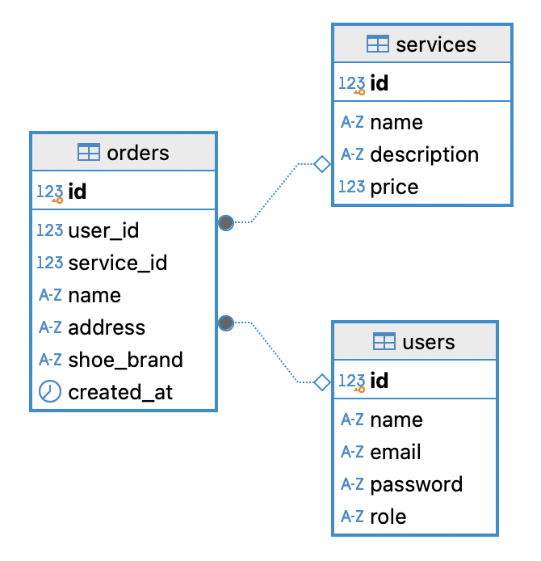

# Zamora Kicks Care 👟🧼

Zamora Kicks Care adalah website layanan cuci sepatu yang modern. Website ini dirancang untuk memudahkan pengguna dalam memesan layanan pencucian sepatu serta mengelola layanan tersebut melalui sistem admin dan user.

---

## 📝 Deskripsi

Zamora Kicks Care membantu pelanggan untuk:
- Mendaftar dan login sebagai user
- Memilih layanan cuci sepatu
- Mengunggah foto sepatu mereka
- Melacak status pesanan

Admin juga dapat mengelola semua data yang masuk seperti pengguna, layanan, dan pesanan.

---

## ✨ Fitur

### Untuk User:
- Registrasi dan login
- Melihat daftar layanan cuci sepatu
- Melakukan pemesanan (upload foto sepatu)
- Melihat status pesanan mereka

### Untuk Admin:
- Login sebagai admin
- CRUD layanan cuci sepatu
- Melihat dan memperbarui status pesanan
- Mengelola data user

---

## 🗂 Entity Relationship Diagram (ERD)

Berikut adalah ERD dari aplikasi Zamora Kicks Care:

**Tabel:**

- `users`
  - `id` (PK)
  - `name`
  - `email`
  - `password`
  - `role` (`admin` / `user`)

- `services`
  - `id` (PK)
  - `name`
  - `description`
  - `price`

- `orders`
  - `id` (PK)
  - `user_id` (FK → users)
  - `service_id` (FK → services)
  - `status`
  - `photo_url`
  - `created_at`

---

## 🛠 Tech Stack

**Frontend:**
- React.js
- Tailwind CSS
- Axios

**Backend:**
- Node.js + Express.js
- JSON Web Token (JWT) untuk autentikasi

**Database:**
- PostgreSQL
- Supabase (jika di-host online)

**Tools:**
- DBeaver (untuk manajemen database)
- Postman (untuk testing API)
- Git & GitHub (versi kontrol)

---

> Dibuat oleh Mora Fidela ❤️
